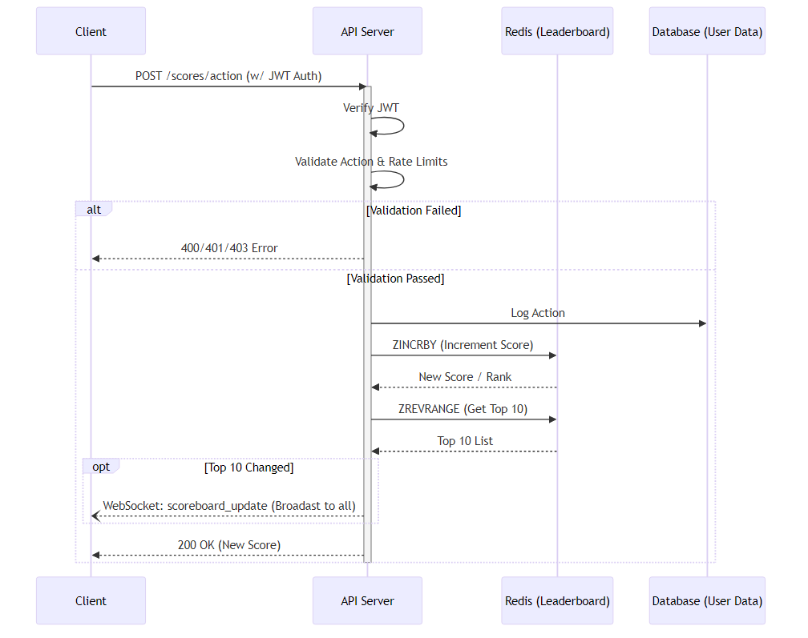

# Problem 6: Scoreboard API Module Architecture

*This document contains the architectural design and API specification for Problem 6 of the 99Tech Backend Engineer Code Challenge.*

## Overview
Architecture and API design for a live scoreboard module. Handles score updates, validation, and real-time top-10 broadcasting.

---

## 1. System Components
*   **Client (Frontend):** Initiates score actions, listens to WebSocket for real-time updates.
*   **API Server (Backend):** Handles REST requests, validates actions, manages WebSocket connections.
*   **Database:** Relational/NoSQL for user data. **Redis Sorted Sets (`ZINCRBY`, `ZREVRANGE`)** recommended for O(log(N)) leaderboard ranking.

---

## 2. API Endpoints

### 2.1. Update User Score
*   **Endpoint:** `POST /api/v1/scores/action`
*   **Auth:** Bearer Token (JWT)
*   **Payload:**
    ```json
    {
      "actionId": "string",
      "executionId": "string", // Unique UUID (Idempotency)
      "timestamp": "ISO 8601 string"
    }
    ```

### 2.2. Get Top 10 Scoreboard
*   **Endpoint:** `GET /api/v1/scores/top`
*   **Response:** `{"scoreboard": [{ "userId", "username", "score" }]}`

---

## 3. Real-time Communication (WebSocket)
*   **URL:** `ws://api.example.com/live-scores`
*   **Event:** `scoreboard_update` (Emitted by server only when the top 10 changes).

---

## 4. Execution Flow


---

## 5. Security Measures

| Threat | Prevention Mechanism | Description |
| :--- | :--- | :--- |
| **Authentication Flow** | **Strict JWT Validation** | User identity is extracted directly from the JWT signature. The client cannot spoof another `userId`. |
| **Rapid Fire Bots** | **Rate Limiting** | Strict IP/User throttling (e.g., max 1 action per 5 seconds) prevents automated score inflation. |
| **Payload Tampering / Double-Claiming / Fake Actions** | **Synchronous Database Validation** | The API validates the event using a composite database key (`userId` + `actionId` + `executionId`) directly against the live game state. If the action is invalid or the composite key is already marked `CLAIMED` in the database, the HTTP request is synchronously rejected. |


